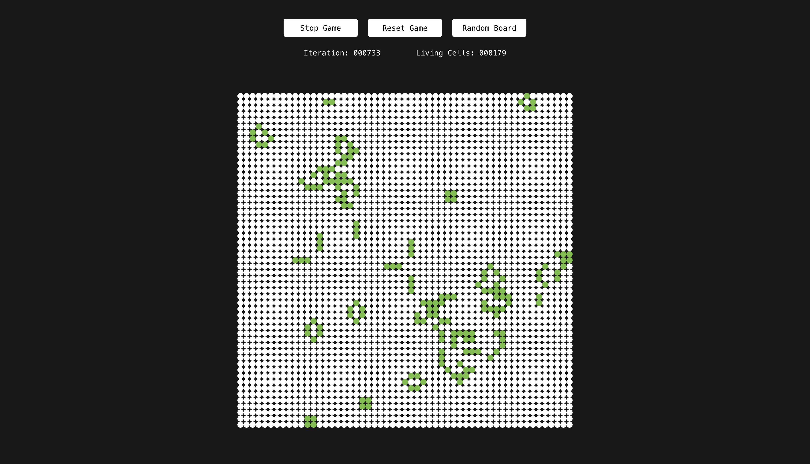

# <h1 class="gradient">Conway's Game of Life</h1>

John Horton Conway's Game of Life (aka Life) is a cellular automaton that visualizes the evolution of state within a system.

The rules are as follows:

1. Any live cell with fewer than two live neighbors dies, as if by underpopulation.
1. Any live cell with two or three live neighbors lives on to the next generation.
1. Any live cell with more than three live neighbors dies, as if by overpopulation.
1. Any dead cell with exactly three live neighbors becomes a live cell, as if by reproduction.

Click around to create your initial state, and then hit Start Game to get going. There are some initial states that can produce some fascinating outcomes. Read about them on [Wikipedia](https://en.wikipedia.org/wiki/Conway%27s_Game_of_Life) or on [LifeWiki](https://conwaylife.com/wiki), Life's dedicated wiki.

The color of the living cells represents how much of the board is alive at that moment, with reddish brown representing death, and each color after representing more and more life.

This version of Life is toroidal, with each of the edges virtually connected to one another, creating an infinitely repeating board effect.

I also have to shout-out by far the coolest visual representation of a toroidal Game of Life by Tim Hau, which you can check out [here](https://observablehq.com/@timhau/conways-game-of-life-on-a-torus). Beautifully done 👏🏼

---

---

 
This project was generated with <a href="https://github.com/angular/angular-cli">Angular CLI</a> version 17.3.2.

## Development server

Run `ng serve` for a dev server. Navigate to `http://localhost:4200/`. The application will automatically reload if you change any of the source files.

## Code scaffolding

Run `ng generate component component-name` to generate a new component. You can also use `ng generate directive|pipe|service|class|guard|interface|enum|module`.

## Build

Run `ng build` to build the project. The build artifacts will be stored in the `dist/` directory.

##### Sorry GitHub folks, pardon the styles...

